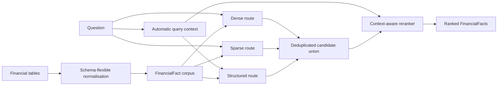

# Beyond Relevant Tables: Schema-Flexible, Context-Aware Exact-Cell Retrieval for Financial RAG

## Honours research proposal

**Candidate:** Loc Nguyen 
**Supervisor:** A/Prof Wei Liu 
**Program:** Bachelor (Honours) 
**Institution:** University of Technology Sydney 
**Proposal revision:** 16 August 2026 
**Planned duration:** 10–12 weeks

## Abstract

Financial question-answering systems can retrieve a relevant filing or table yet still select the wrong number. Nearby values may describe the same entity and concept while differing in reporting period, unit, accounting basis, product, geography, scenario, maturity band, or another dimension defined only by that table. Dense retrieval is useful for finding semantically related evidence, but semantic similarity does not guarantee that the selected value satisfies all context expressed by a question. Conversely, structured database lookup is precise only when the source and question can be represented by a known schema.

This project proposes a controlled study of schema-flexible, context-aware exact-cell retrieval over large collections of financial filings. Every addressable table value will be represented as a `FinancialFact` containing its entity, concept, period, unit, value, source and provenance, together with complete raw row and column header paths and arbitrary additional name–value dimensions. The representation therefore preserves new table contexts without requiring a fixed taxonomy of scope fields. Dense, sparse and structured retrieval routes will search the same corpus. A context-aware reranker will compare both common fact fields and table-specific dimensions, first using ordinary negatives and then naturally confusing financial alternatives.

The primary corpus is a pinned cleaned revision of T²-RAGBench. A human-verified subset will supply exact target facts and natural distractors. A pinned 150-row FinanceBench release will provide external validation after its filing PDFs are separately acquired and verified. The complete method will be compared with flattened-chunk hybrid RAG, `FinancialFact` hybrid retrieval with a generic reranker, and automatic structured lookup. B0 will be assessed using chunk coverage and downstream answer metrics; B1–M3 will be assessed using exact-cell Hit@1 because only those conditions return addressable fact rankings. The study will also test generalisation to unseen companies, filings and table structures, measure computational cost, and separate parsing, retrieval, reranking and answer-rendering failures.

The work does not claim to introduce the first cell-level RAG system. Its contribution is a controlled empirical test of whether a schema-flexible representation and context-aware ranking add value beyond both conventional RAG and simpler structured lookup.

**Keywords:** financial question answering; retrieval-augmented generation; table retrieval; exact-cell retrieval; schema flexibility; context-aware reranking; numeric error

## 1. Plain-language summary

Financial reports contain many similar numbers. A revenue table might contain several years, currencies, products and regions. A search model may understand that a question is about revenue but still choose the value from the wrong column or a row with a different context.

One possible solution is a database with a column for every important property. That works when all tables use the same fields. Real financial tables do not. One may use business segment and another may use geography, maturity, scenario or a locally named category.

This project stores each table value as a small fact. The fact records who and what the number describes, its period and unit, where it came from, the complete table headers around it, and any other dimensions found in that table. Search can still use embeddings to understand language, but it can also compare the exact context. The experiment asks whether this approach chooses the correct cell more often than normal RAG and structured lookup.

## 2. Background and motivation

Retrieval-augmented generation grounds a language model in retrieved evidence rather than relying only on model parameters (Lewis et al., 2020). In financial QA, however, document relevance is weaker than answer relevance. A filing may be correct while the selected table, row or cell is not.

FinanceBench illustrates the broader difficulty of financial QA. Its study evaluated a 150-case public sample and reported high error and refusal rates even for a strong retrieval-assisted model (Islam et al., 2023). T²-RAGBench later isolated large-corpus text-and-table retrieval before numerical reasoning and showed that retrieval quality changes substantially when a system must search across many financial contexts (Strich et al., 2026).

Table-specific structure matters because a number has no stable meaning by itself. Its identity is formed by the intersection of row headers, column headers, units, reporting period, document provenance and any additional dimensions encoded by the table. Flattening a table into text can weaken these relationships. A fixed schema can preserve some relationships but discard dimensions that were not anticipated when the schema was designed.

The research problem is therefore not simply how to read a table. It is how to preserve and retrieve the complete contextual identity of a value across heterogeneous table structures.

## 3. Problem statement

A financial RAG pipeline can fail at several stages:

1. the table can be parsed incorrectly;
2. contextual relationships can be lost during normalisation;
3. the correct fact can be absent from the candidate set;
4. the correct fact can be present but ranked below a contextually similar alternative; or
5. correct evidence can be retrieved but rendered incorrectly in the answer.

Many end-to-end evaluations combine these stages. A wrong final number therefore does not establish whether retrieval was responsible. This project isolates exact-cell retrieval as the primary mechanism while retaining downstream answer accuracy as a secondary outcome.

A second problem is schema assumption. A design based only on a fixed list such as company, metric, year, unit and segment may work for familiar statements but fail when a new table introduces an unanticipated context. The proposed representation retains a small common core and an open map of arbitrary table dimensions.

## 4. Focused literature review

This proposal uses a focused prior-art review of primary paper pages, official repositories and peer-reviewed proceedings available through 12 August 2026. It is not a systematic review, and no universal novelty claim is made.

| Work | Relevant contribution | Implication for this study |
|---|---|---|
| [TableRAG: Million-Token Table Understanding](https://proceedings.neurips.cc/paper_files/paper/2024/hash/88dd7aa6979e352fda7c4952ca8eac59-Abstract-Conference.html) | Retrieves schemas and cells from very large tables. | Cell retrieval and large-table scaling already exist. |
| [THYME](https://aclanthology.org/2025.emnlp-main.1409/) | Uses field-aware dense and sparse matching across table regions. | Different structural regions benefit from different matching behaviour. |
| [TableRAG for heterogeneous document reasoning](https://aclanthology.org/2025.emnlp-main.710/) | Combines retrieval, SQL generation, execution and intermediate answers. | Structured lookup is a necessary competing baseline. |
| [FinGEAR](https://aclanthology.org/2025.findings-emnlp.382/) | Uses finance-specific hierarchical indexes and reranking over filings. | Financial retrieval benefits from domain structure, but its outcome is not an exact fact identity. |
| [DocReRank](https://aclanthology.org/2025.emnlp-main.436/) | Trains rerankers with highly similar, unanswerable financial negatives. | Financial hard negatives are not new by themselves. |
| [FinCARDS](https://aclanthology.org/2026.findings-acl.1244/) | Maps questions and evidence to finance-aware constraints before reranking. | It is close prior work and motivates a controlled, lower-level fact study. |
| [HierFinRAG](https://doi.org/10.3390/informatics13020030) | Uses hierarchical graph retrieval down to financial table cells. | Financial cell-level and graph RAG already exist. |
| [FT-RAG](https://arxiv.org/abs/2605.01495) | Represents tables as entry-level graph units and reports cell retrieval metrics. | Exact-cell graph retrieval is not new. |
| [TCR-Bench](https://arxiv.org/abs/2607.17742) | Studies confusion between semantically similar but logically different tables. | Relevance and answerability can diverge even when structures look similar. |
| [T²-RAGBench](https://aclanthology.org/2026.eacl-long.8/) | Provides large-corpus financial text-and-table retrieval data. | It supplies the primary corpus but not complete exact-cell gold labels. |

### 4.1 Defensible research gap

Prior work has already used cell retrieval, table fields, SQL, graphs, finance-aware constraints and hard negatives. The defensible gap is narrower:

> It remains unclear whether a schema-flexible fact representation and context-aware reranker reduce naturally occurring wrong-cell errors beyond both strong hybrid retrieval and automatic structured lookup, especially when companies, filings and table structures are unseen during training.

This gap supports either outcome. If the proposed method wins, it shows that learned contextual matching adds value. If structured lookup performs equally well at lower cost, the study establishes a useful boundary and argues against unnecessary complexity.

## 5. Aim, research questions and hypotheses

### 5.1 Aim

To determine whether schema-flexible, context-aware exact-cell retrieval reduces retrieval-induced wrong-number errors in financial QA compared with conventional hybrid RAG and structured database lookup.

### 5.2 Primary research question

> In a large collection of financial filings, does schema-flexible, context-aware exact-cell retrieval reduce wrong-cell retrieval errors compared with conventional hybrid RAG and structured database lookup?

### 5.3 Generalisation subquestion

> Does the method continue to work on unseen companies, filings, and table structures?

### 5.4 Supporting questions

- **RQ1:** How often does a strong retrieval system find relevant evidence while selecting or supporting the wrong cell?
- **RQ2:** Does combining dense, sparse and structured routes improve correct-fact candidate coverage?
- **RQ3:** Does schema-flexible context-aware reranking improve exact-cell Hit@1 beyond a generic reranker and structured lookup?
- **RQ4:** Does training with natural finance hard negatives improve over the same reranker trained with ordinary negatives?
- **RQ5:** Which fact or arbitrary-dimension mismatches remain after reranking?
- **RQ6:** Does improved fact retrieval increase final value, unit and evidence-supported answer accuracy under a fixed renderer or generator?
- **RQ7:** What latency, memory, storage and training costs are introduced?

### 5.5 Hypotheses

- **H1:** M3 will achieve higher exact-cell Hit@1 than B1.
- **H2:** M3 will achieve higher exact-cell Hit@1 than B2.
- **H3:** M3 will reduce wrong-context errors, including errors involving common fact fields and arbitrary table dimensions.
- **H4:** M3 will outperform M2, showing additional value from natural finance hard negatives over ordinary negatives.
- **H5:** Under the same renderer or generator, improved fact retrieval will increase normalised answer accuracy.
- **H6:** The primary improvement will remain on unseen companies, filings and table-structure families.

H1 and H2 are co-primary. An improvement smaller than five percentage points in exact-cell Hit@1 will be treated as practically small even if statistically detectable.

## 6. Objectives

1. Define a schema-flexible `FinancialFact` representation with stable provenance.
2. Construct a human-verified exact-cell benchmark with valid fact sets and natural alternatives.
3. Implement controlled B0–B2 and M1–M3 conditions.
4. Separate candidate-generation, reranking, parsing and rendering failures.
5. Compare ordinary and natural-finance negative training.
6. Test generalisation across companies, filings and table structures.
7. Measure retrieval quality, downstream answers and computational cost.
8. release reproducible configurations, manifests, traces and legally redistributable annotations.

## 7. Scope and boundaries

### Included

- public English-language financial reports and filings;
- direct-value questions answerable from one table cell;
- corpus-scale dense, sparse and structured retrieval;
- exact-cell ranking for `FinancialFact` conditions;
- deterministic answer rendering and an optional fixed local generator;
- exact-cell annotation and field/dimension error analysis.

### Excluded from the primary experiment

- arithmetic, ratios, aggregation and multi-step programs;
- multi-table reasoning;
- narrative-only questions;
- training a VLM or claiming PDF parsing as the research contribution;
- GraphRAG as the proposed architecture;
- NLI verification, arithmetic verification or conformal abstention;
- paid or moving external APIs in the reproducibility-critical path;
- production deployment and financial advice.

## 8. Proposed system

### 8.1 FinancialFact

Each addressable value is represented as:

| Component | Content |
|---|---|
| Common identity | entity, concept, period, unit, value |
| Provenance | dataset, document, filing, page, table, row, column, stable IDs and hashes |
| Structural context | complete raw row-header and column-header paths |
| Open context | arbitrary name–value dimensions derived from the table |
| Fidelity | raw value, normalised value, parser status and explicit unknown indicators |

The common fields make facts comparable across tables. The open dimension map preserves table-specific context. It may hold a segment, geography, product, scenario or any other dimension, but these are examples rather than a closed schema.

Canonical dimension names use a versioned normaliser fitted on training data only. Raw dimension names, raw values and their source header paths remain available after normalisation. A parser may map a raw header to a common concept, but the original text and provenance are never replaced.

### 8.2 Automatic query context

For B2 and M1–M3, the question is converted into a matching context with:

- common fields where they can be extracted;
- arbitrary named constraints where the wording supports them;
- explicit status for present, absent, unknown or ambiguous information; and
- a confidence or provenance trace for every extracted value.

Missing context is masked rather than scored as a mismatch. Human query fields are allowed only as an oracle diagnostic, never in the main comparison.

The parsed constraints are used by the structured route in B2 and M1–M3, and by the context-aware reranker in M2–M3. Dense retrieval, sparse retrieval and the generic M1 reranker continue to receive the raw question, so M1 does not gain a hidden query-rewriting advantage over B1.

### 8.3 Retrieval routes

1. **Dense route:** semantic similarity over configured representations.
2. **Sparse route:** exact and lexical matching over questions, concepts, headers, units and dimension text.
3. **Structured route:** constraint matching over common fields and arbitrary dimension pairs.

M1–M3 run the routes in parallel and deduplicate the candidate union by stable evidence identity.

### 8.4 Context-aware reranker

M2 and M3 rerank a candidate using:

- a generic question–fact representation;
- dense, sparse and structured retrieval scores;
- compatibility of entity, concept, period, unit and value type;
- compatibility of arbitrary query and fact dimensions;
- raw-header-path evidence; and
- explicit indicators for missing or contradictory context.

The architecture must accept any number of dimensions. It must not require a new model input position every time a new table category appears.

### 8.5 Negative training

M2 uses ordinary negatives sampled according to the configured training policy. M3 uses natural finance hard negatives, such as:

- the same concept for a different period;
- the same concept and period for a different entity;
- the same displayed value under a different unit;
- similar headers with one different local dimension; and
- a nearby but contextually incorrect value.

Every negative is checked against the valid-gold set so that a legitimate alternative is not trained as incorrect.

### 8.6 Architecture

## 9. Data

### 9.1 Primary corpus: T²-RAGBench

The primary source is `G4KMU/t2-ragbench`, pinned at revision `adf7fe1541ac37351ce1142544d8e3b43010ed92`. The configured cleaned release contains 23,088 rows across ConvFinQA, FinQA and TAT-DQA metadata.

Every configured source file has an expected row count, byte count and SHA-256 digest. The audit must pass before derived data are created. The source families have materially different schemas and table encodings, making them useful for testing schema flexibility.

T²-RAGBench does not directly supply complete exact-cell labels for this study. Automatic answer–cell matching is used only to find annotation candidates, not to declare gold cells.

### 9.2 External validation: FinanceBench

The external dataset is `PatronusAI/financebench`, configuration `default`, split `train`, pinned at revision `e04404e3a97f69f79c14d42f24981a1c9c3bcd18`. The split contains 150 rows and 15 metadata fields.

The metadata include document links and evidence but not a complete stable `FinancialFact` identity. Filing PDFs must therefore be acquired and verified separately. A question enters external exact-cell evaluation only after its source table and valid target fact set have been checked against a readable filing.

### 9.3 Eligibility

A question enters the exact-cell set only when:

- its answer is explicitly displayed in one table cell;
- the complete table can be identified;
- no arithmetic is required;
- a valid fact set can be annotated; and
- natural contextual alternatives can be distinguished reliably.

All exclusions and reasons are recorded before system evaluation.

### 9.4 Splits

Splits are grouped by company and filing. Questions, tables, paraphrases, source-derived examples and hard negatives from the same document family remain together. The final evaluation reports:

- in-distribution results;
- unseen-company results;
- unseen-filing results; and
- unseen-table-structure results.

A table-structure family is defined using configured structural features, not a judgement made after observing system errors.

## 10. Gold annotation

Every eligible question records:

- all valid source cell IDs, which alone define exact-cell correctness;
- derived fact IDs as representation lineage only;
- raw and normalised answers;
- complete common fields;
- complete raw header paths;
- arbitrary table dimensions and their evidence;
- natural confusing alternatives;
- ambiguity and exclusion reasons; and
- annotator and adjudication provenance.

A second annotator independently reviews at least 20–25% of the set. Report exact-address agreement and component-level agreement. Preserve pre-consensus labels. If exact-address agreement remains below 80% after one guideline refinement, narrow the target definition or data scope before final evaluation.

## 11. Experimental conditions

| ID | Representation and retrieval | Training | Valid retrieval metrics |
|---|---|---|---|
| **B0** | Flattened chunks; dense + sparse hybrid | None | Chunk coverage and context recall |
| **B1** | `FinancialFact`; dense + sparse; generic reranker | No project training | Exact-cell metrics |
| **B2** | Automatic query context; structured lookup | None | Exact-cell metrics |
| **M1** | Parallel dense + sparse + structured union; generic reranker | No project training | Exact-cell metrics |
| **M2** | M1 + schema-flexible context-aware reranker | Ordinary negatives | Exact-cell metrics |
| **M3** | M2 + natural finance hard-negative training | Natural hard negatives | Exact-cell metrics |

M3 is compared confirmatorily with B1 and B2. B0 remains important as the conventional RAG baseline, but a flattened chunk is not treated as an exact-cell ranking. All conditions may be compared downstream with the same pinned generator and prompt. Deterministic fact rendering is reported separately for B1–M3.

All conditions use the same frozen corpus, split manifest, hardware policy, candidate budgets where comparable, generation prompt and evaluation implementation. B2 receives the same automatic query context as M1–M3.

The final reranker input budget is held equal for the cell-ranking conditions. M1–M3 deliberately search an additional route, so route-level latency and candidate counts are reported, and a budget-matched sensitivity analysis repeats the comparison at final candidate counts of 20, 50 and 100.

## 12. Evaluation

### 12.1 B0 retrieval outcomes

- evidence coverage at configured cutoffs;
- context recall at configured cutoffs; and
- retrieval latency and index cost.

### 12.2 B1–M3 retrieval outcomes

Primary:

- exact-cell Hit@1.

Secondary:

- exact-cell Recall@5, Recall@10 and Recall@20;
- mean reciprocal rank;
- candidate-generation miss rate;
- reranking miss rate;
- wrong-entity, concept, period, unit or arbitrary-dimension rates; and
- latency, index size, memory and throughput.

### 12.3 Downstream outcomes for all conditions

- normalised exact answer match;
- value accuracy;
- unit accuracy; and
- whether the answer is supported by retrieved evidence.

A fixed local generator with one pinned revision and prompt provides the cross-condition downstream comparison. For B1–M3, a deterministic fact renderer is also reported as a lower-variance diagnostic; it is not applied to B0 chunks.

Exact-cell success is defined only by `RankedFact.fact.source_address.cell_id` belonging to the valid gold source-cell set. Final rankings are deduplicated by source cell ID. For field-error attribution with multiple valid cells, the evaluator selects the gold cell with the fewest configured mismatches and breaks ties by stable cell ID; the chosen comparison cell remains in the raw trace.

### 12.4 Statistical analysis

Every applicable condition produces paired outcomes for the same questions. Report absolute percentage-point changes, relative error reduction and 95% confidence intervals.

- Use a paired cluster bootstrap by filing with the configured number of resamples.
- Treat M3 versus B1 and M3 versus B2 as co-primary and apply Holm correction.
- Report at least three configured training seeds for M2 and M3.
- Treat field, dimension and structure-family analyses as secondary unless sufficiently powered.
- Do not interpret `p < .05` without effect size and confidence interval.
- Treat an exact-cell improvement below five percentage points as practically small.

B0 is excluded from exact-cell statistical comparisons because it does not emit a cell ranking. It remains comparable on downstream answer accuracy and cost.

## 13. Ablations and diagnostic experiments

Priority ablations are:

1. remove the structured route from M1;
2. replace the context-aware reranker with the generic reranker;
3. remove arbitrary dimensions while retaining common fields;
4. remove raw header paths while retaining normalised fields;
5. compare ordinary with natural-finance negatives; and
6. compare automatic with oracle query context as a diagnostic upper bound.

Oracle context is never reported as the deployable primary method.

## 14. Error attribution

Assign every failed answer to the earliest identifiable stage:

1. source table unavailable or corrupted;
2. table or fact normalisation error;
3. query-context extraction error;
4. valid fact absent from the candidate set;
5. valid fact present but ranked incorrectly;
6. correct fact retrieved but answer rendered incorrectly; or
7. gold annotation ambiguous or incomplete.

This prevents a retrieval method from receiving credit for parser improvements or blame for generator errors.

## 15. Interpretation rules

### Method superiority

Claim superiority only if M3 improves exact-cell Hit@1 by at least five percentage points over both B1 and B2, the cluster-bootstrap confidence intervals exclude zero, and the improvement persists on unseen data.

### Structured lookup sufficient

If B2 is within two percentage points of M3 and materially cheaper or faster, conclude that additional learned complexity is not justified for the primary setting.

### Representation benefit without training benefit

If M1 or M2 matches M3, conclude that candidate union or schema-flexible context is useful but natural hard-negative training adds little.

### Parser bottleneck

If oracle context helps but automatic context does not, identify query or table normalisation as the limiting stage rather than claiming reranker failure.

### Data limitation

If fewer than 200 natural exact-cell questions can be verified, or source filings are too concentrated, present the study as a benchmark and case analysis rather than broad superiority evidence.

## 16. Validity and limitations

| Threat | Risk | Mitigation |
|---|---|---|
| Construct validity | Exact-cell correctness is not identical to final answer quality. | Use cell outcomes for the mechanism and fixed downstream outcomes separately. |
| Baseline comparability | A B0 chunk can contain many cells, and B1 also adds a reranker. | Never report B0 exact-cell Hit@1 or interpret B0→B1 as a clean granularity ablation; compare coverage and downstream answers descriptively. |
| Fixed-schema bias | Chosen fields may fit familiar statements only. | Preserve arbitrary dimensions and complete raw header paths. |
| Query-context privilege | M conditions may receive extra information. | Give identical automatic context to B2 and M1–M3. |
| Parsing confound | Better parsing may appear as better retrieval. | Freeze normalisation and report oracle diagnostics separately. |
| Leakage | Related documents may cross splits. | Group by company, filing and derived family. |
| Synthetic bias | Generated negatives may not reflect natural errors. | Use natural source-table alternatives for M3 and keep natural questions primary. |
| Statistical dependence | Questions within a filing are correlated. | Bootstrap by filing and report independent cluster counts. |
| Candidate-budget advantage | Additional routes expose M1–M3 to more first-stage candidates. | Hold final reranker input fixed, report route cost and repeat budget-matched sensitivity analyses. |
| External validity | Public English filings do not cover every financial document. | Limit claims and use FinanceBench external validation. |
| Temporal validity | Hosted data and models may change. | Pin immutable revisions and record hashes. |

The proposed system may not outperform structured lookup. That would be a valid result rather than a project failure if the comparison and benchmark remain rigorous.

## 17. Feasibility and schedule

### Resources

- Python 3.11 and local open-source components;
- one development workstation, with optional single-GPU access;
- approximately 20–40 GB for metadata, documents, indexes, models and outputs;
- approximately 30–50 hours for exact-cell annotation and 6–10 hours for independent checking; and
- no paid API dependency in the primary experiment.

### Twelve-week plan

| Week | Work | Deliverable |
|---|---|---|
| 1 | Freeze contract, pins and eligibility rules | Design freeze and configs |
| 2 | Run data audit and schema analysis | Stamped feasibility audit |
| 3 | Build and validate 30-question pilot | Annotation guide and timing |
| 4 | Complete core gold set; implement B0 and B1 | Baseline traces |
| 5 | Implement automatic query context and B2 | Structured baseline |
| 6 | Implement three routes and M1 | Candidate-union system |
| 7 | Implement M2 and M3; train configured seeds | Complete method |
| 8 | Tune on development data and freeze test configs | Experiment manifest |
| 9 | Run locked T²-RAGBench and FinanceBench evaluation | Raw results |
| 10 | Statistics, error attribution and ablations | Tables and figures |
| 11 | Robustness, efficiency and writing | Draft results and discussion |
| 12 | Clean-clone reproduction and thesis finalisation | Reproduction report |

If time is lost, optional generation analysis and lower-priority ablations are removed before weakening exact-cell labels, omitting B2 or compromising reproducibility.

## 18. Reproducibility and data management

1. Python 3.11 with a pinned `uv.lock`.
2. One base YAML merged with one condition or workflow override.
3. Every dataset and model identified by immutable revision where available.
4. All paths, seeds, budgets, thresholds, model names, revisions and training settings stored in YAML.
5. Raw data immutable; derived artifacts store parent and transformation hashes.
6. Every result records timestamp, Git commit, stable config hash, full resolved config, dataset revision, dataset-manifest hash, software environment and hardware.
7. Raw per-question candidate traces retained.
8. Test-set reruns recorded with reasons.
9. A CPU smoke test checks config loading, imports, audit fixtures and result stamping.
10. `make eval` regenerates reported outputs from a fresh clone after data acquisition once algorithms are implemented.

The repository is currently an interface-only scaffold. Apart from the dataset audit, scientific algorithms intentionally raise `NotImplementedError`. This prevents incomplete interfaces from creating outputs that look like experimental evidence.

## 19. Ethics, licensing and responsible use

The project uses public benchmark metadata and public corporate filings. A written ethics determination should still be obtained through the appropriate UTS process.

The study will:

- state that the system is a research prototype and not financial advice;
- use no confidential or personally sensitive financial data;
- avoid uploading documents to external APIs in the primary experiment;
- document dataset and model licences;
- release only annotations and derived artifacts that may legally be redistributed;
- preserve a separate acquisition record for FinanceBench filing PDFs; and
- document bias toward English-language reports and large public companies.

## 20. Expected contributions

### Representation contribution

A reproducible `FinancialFact` contract that combines common financial identity with arbitrary table dimensions and complete raw structural context.

### Diagnostic contribution

A human-verified exact-cell benchmark with valid target sets, natural contextual alternatives, held-out company/filing/structure splits and stage-specific error labels.

### Method contribution

A controlled schema-flexible, context-aware reranker evaluated with ordinary and natural-finance negative training.

### Empirical contribution

Evidence showing when hybrid retrieval, structured lookup or learned context-aware ranking is sufficient, including accuracy–cost trade-offs and negative results.

### Reproducibility contribution

A configuration-driven harness with immutable dataset pins, manifests, candidate traces, provenance-stamped outputs and clean-clone execution.

These are intended contributions, not claims that no prior system has retrieved financial table cells.

## 21. Publication potential

Publication potential depends on the quality of exact-cell labels, a fair B2 comparison, natural held-out errors, generalisation to unseen structures, computational reporting and full reproducibility. A clear M3 improvement could support a finance-NLP workshop or applied paper. A null result can remain publishable if the benchmark and analysis show that structured lookup is sufficient or identify where schema flexibility matters.

Publication cannot be guaranteed before results exist.

## 22. Risk register

| Risk | Likelihood | Impact | Response |
|---|---:|---:|---|
| Exact cells cannot be reconstructed reliably | Medium | High | Pilot first; narrow sources if agreement remains low |
| FinanceBench PDFs cannot be acquired reproducibly | Medium | High | Keep metadata pin; document acquisition; limit external claims if unavailable |
| Fixed normalisation loses new dimensions | Medium | High | Preserve raw paths and arbitrary dimension pairs |
| Structured lookup matches M3 | Medium | Medium | Report the boundary result and cost advantage |
| Natural hard negatives are false negatives | Medium | High | Validate against complete gold sets |
| Too few independent filings | Medium | High | Report cluster counts and limit inferential claims |
| M3 exceeds time or compute budget | Medium | Medium | Preserve B0–B2/M1/M2 and drop optional analyses first |
| Close prior work weakens novelty | High | High | Avoid priority claims; centre controlled evaluation and reusable data |

## 23. Deliverables

1. Approved design freeze and research proposal.
2. Pinned T²-RAGBench and FinanceBench manifests.
3. Stamped T²-RAGBench feasibility audit.
4. `FinancialFact` schema and normalisation contract.
5. Human-verified exact-cell annotation guide and dataset extension.
6. B0–B2 and M1–M3 configurations and implementations.
7. Per-question traces, rankings, metrics and error labels.
8. Statistical analysis and publication-quality figures.
9. Thesis chapter or paper-ready manuscript.
10. Clean-clone reproduction report.

## 24. Conclusion

The project addresses a precise financial RAG failure: relevant evidence can be retrieved while the wrong contextual value is selected. The proposed design does not assume that every table can be described by one fixed list of fields. It represents each value as a `FinancialFact` with a stable common identity, complete raw structure and arbitrary dimensions, then tests whether context-aware ranking improves over both conventional RAG and structured lookup.

The strongest feature of the study is its controlled design. B0 is assessed honestly as chunk retrieval, B1–M3 are assessed as exact-cell retrieval, parsing and rendering failures are separated, and generalisation includes unseen table structures. This design can produce a useful positive, null or negative result without claiming to be the first cell-level RAG architecture.

## References

Chen, S.-A., Miculicich, L., Eisenschlos, J. M., Wang, Z., Wang, Z., Chen, Y., Fujii, Y., Lin, H.-T., Lee, C.-Y., & Pfister, T. (2024). *TableRAG: Million-token table understanding with language models*. Advances in Neural Information Processing Systems, 37. https://doi.org/10.52202/079017-2382

Chen, Z., Chen, W., Smiley, C., Shah, S., Borova, I., Langdon, D., Moussa, R., Beane, M., Huang, T.-H., Routledge, B., & Wang, W. Y. (2021). FinQA: A dataset of numerical reasoning over financial data. *Proceedings of EMNLP 2021*, 3697–3711. https://doi.org/10.18653/v1/2021.emnlp-main.300

Choi, C., Kwon, J., Ha, J., Choi, H., Kim, C., Lee, Y., Sohn, J., & Lopez-Lira, A. (2025). *FinDER: Financial dataset for question answering and evaluating retrieval-augmented generation*. arXiv. https://arxiv.org/abs/2504.15800

Dang, Q.-V., Nguyen, N.-S.-A., & Vo, T.-B.-D. (2026). HierFinRAG—Hierarchical multimodal RAG for financial document understanding. *Informatics, 13*(2), Article 30. https://doi.org/10.3390/informatics13020030

Guo, Z., Geng, W., & Mao, R. (2026). *FT-RAG: A fine-grained retrieval-augmented generation framework for complex table reasoning*. arXiv. https://arxiv.org/abs/2605.01495

Islam, P., Kannappan, A., Kiela, D., Qian, R., Scherrer, N., & Vidgen, B. (2023). *FinanceBench: A new benchmark for financial question answering*. arXiv. https://arxiv.org/abs/2311.11944

Lewis, P., Perez, E., Piktus, A., Petroni, F., Karpukhin, V., Goyal, N., Küttler, H., Lewis, M., Yih, W.-T., Rocktäschel, T., Riedel, S., & Kiela, D. (2020). Retrieval-augmented generation for knowledge-intensive NLP tasks. *Advances in Neural Information Processing Systems, 33*. https://proceedings.neurips.cc/paper/2020/hash/6b493230205f780e1bc26945df7481e5-Abstract.html

Li, D., Bi, K., Guo, J., & Cheng, X. (2025). Tailoring table retrieval from a field-aware hybrid matching perspective. *Proceedings of EMNLP 2025*, 27693–27704. https://doi.org/10.18653/v1/2025.emnlp-main.1409

Li, Y., Wang, M., de Carvalho, M., Sabanis, S., & Ma, T. (2025). FinGEAR: Financial mapping-guided enhanced answer retrieval. *Findings of EMNLP 2025*, 7239–7255. https://doi.org/10.18653/v1/2025.findings-emnlp.382

Strich, J., Isgorur, E. K., Trescher, M., Biemann, C., & Semmann, M. (2026). T²-RAGBench: Text-and-table benchmark for evaluating retrieval-augmented generation. *Proceedings of EACL 2026*, 165–191. https://doi.org/10.18653/v1/2026.eacl-long.8

Tian, J., Li, L., Ye, W., Wang, H., Yu, L., Ren, Z., Chen, G., & Zhao, J. (2026). *Semantically similar, logically distinct: Diagnosing the semantic-answerability gap in table RAG*. arXiv. https://arxiv.org/abs/2607.17742

Wasserman, N., Heinimann, O., Golbari, Y., Zimbalist, T., Schwartz, E., & Irani, M. (2025). DocReRank: Single-page hard negative query generation for training multi-modal RAG rerankers. *Proceedings of EMNLP 2025*, 8640–8658. https://doi.org/10.18653/v1/2025.emnlp-main.436

Yu, X., Jian, P., & Chen, C. (2025). TableRAG: A retrieval augmented generation framework for heterogeneous document reasoning. *Proceedings of EMNLP 2025*, 14063–14082. https://doi.org/10.18653/v1/2025.emnlp-main.710

Zhou, Y., Zhang, F., Chen, Y., Zhang, H., Nakov, P., & Xie, Z. (2026). FinCARDS: Card-based analyst reranking for financial document question answering. *Findings of ACL 2026*, 24836–24852. https://doi.org/10.18653/v1/2026.findings-acl.1244

Zhu, F., Lei, W., Huang, Y., Wang, C., Zhang, S., Lv, J., Feng, F., & Chua, T.-S. (2021). TAT-QA: A question answering benchmark on a hybrid of tabular and textual content in finance. *Proceedings of ACL-IJCNLP 2021*, 3277–3287. https://doi.org/10.18653/v1/2021.acl-long.254

## AI assistance disclosure for this proposal

This proposal was prepared with AI assistance for literature discovery, research-design stress testing, organisation, interface planning and language editing. Primary paper pages and official dataset repositories were checked for the factual claims and references included here. The candidate remains responsible for reading the cited papers, confirming the final design with the supervisor, verifying implementations and results, and disclosing AI use according to UTS and any target venue requirements.
